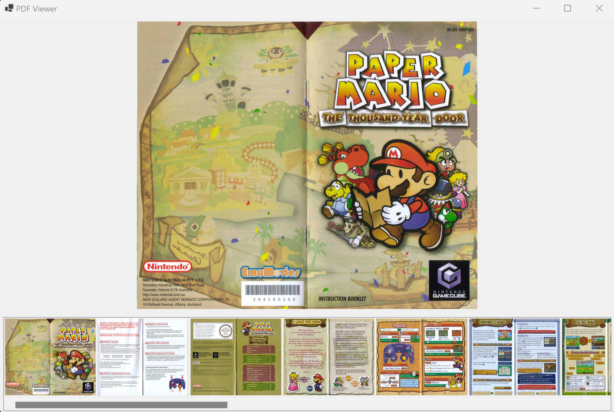

# ViewPDF

This is a basic example of using Pdfium in a winforms application to render/view a pdf file. 

Basic Features
- Load PDF file (only 1 file can be loaded)
- Generate thumbnails for all pages
- Select thumbnail to view page
- Select thumbnail again to rotate page


